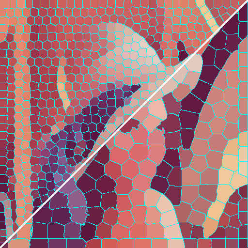

Documents: SLIC (Simple Linear Iterative Clustering) 
=========

**void SLIC(Mat& src, Mat& segment, int regionSize, float regularization, float minRegionRatio, int max_iteration)**  
* Mat& src: input image.  
* Nat& segment: segmentimage image(CV_32S). Each pixel has integer value for labeling.
* int regionSize: nominal size of the regions( parameter S in the refernece paper).   
* float regularzation: a trade-off between appearance and spatial terms (parameter m in the refernece paper).
* int minRegionRatio: ratio of minimum size of a segment for regionSize*regionSize for threshoding minimum regions.   
* int max_iteration: number of max interations.  

**void drawSLIC(Mat& src, Mat& segment, Mat& dest, bool isLine, Scalar line_color)**
* Mat& src: input image.  
* Nat& dest: segmenttation result from the SLIC function.
* bool isLine: draw line or not between segments.
* Scalar line_color: line color.

*Reference*
* Radhakrishna Achanta, Appu Shaji, Kevin Smith, Aurelien Lucchi, Pascal Fua, and Sabine Süsstrunk, SLIC Superpixels Compared to State-of-the-art Superpixel Methods, IEEE Transactions on Pattern Analysis and Machine Intelligence, vol. 34, num. 11, p. 2274 - 2282, May 2012.
* Author's Webpage: http://ivrg.epfl.ch/research/superpixels

Example
-------

**void alphaBlend(const Mat& src1, const Mat& src2, double alpha, Mat& dest)**    

**void alphaBlend(const Mat& src1, const Mat& src2, const Mat& alpha, Mat& dest)**  

**void guiAlphaBlend(const Mat& src1, const Mat& src2)**  
*keyboard short cut*  
* q: quit  
* f: flip alpha value  

**void showMatInfo(InputArray src_, string name)**  

**void cvtColorBGR2PLANE(const Mat& src, Mat& dest)**  

**void patchBlendImage(Mat& src1, Mat& src2, Mat& dest, Scalar linecolor=CV_RGB(0,0,0), int linewidth = 2, int direction = 0)**  

class CalcTime
{
	int64 pre;
	string mes;

	int timeMode;

	double cTime;
	bool _isShow;

	int autoMode;
	int autoTimeMode();
	vector<string> lap_mes;
public:

	void start();
	void setMode(int mode);
	void setMessage(string src);
	void restart();
	double getTime();
	void show();
	void show(string message);
	void lap(string message);
	void init(string message, int mode, bool isShow);

	CalcTime(string message, int mode=TIME_AUTO, bool isShow=true);
	CalcTime();

	~CalcTime();
};
